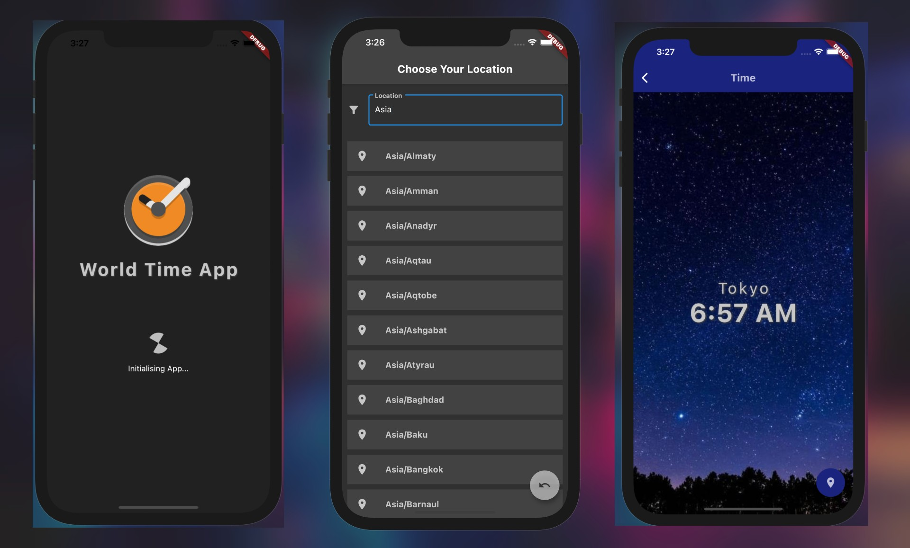

# World Time App

A simple app to get times of places from around the around.

- [download here](https://webapp.diawi.com/install/zTByyV)  
  (or)
- Scan QR code  
  
  ***
  

## Built using

- Flutter
- Dart
- WorldTimeAPI
- MaterialDesign

## To run locally

- Clone the repository with `git clone https://github.com/Pradeep-selva/world-time-app.git`
- Install dependencies with `pub get`
- Run the app with `flutter run`

## License

[MIT](LICENSE) © [Pradeep-selva](https://github.com/Pradeep-selva)
